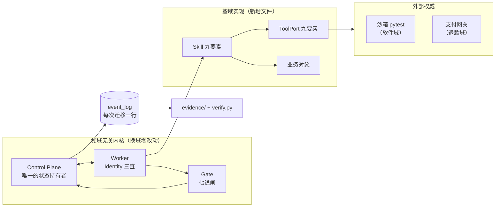

# MAOS —— 多 Agent 协作运行时

一条制造企业的售后退款诉求，从客户投诉到钱有没有到账，全程由多个 Agent 协作完成，
**每一步都留下可以被外人重放核验的证据**。

（政策与历史案例是按行业惯例构造的合成数据，支付网关的错误码与时序取自公开规范
——口径见 [§8](#8-与提案--比赛要求的映射)，不含糊。）

```bash
python3 scripts/make_evidence.py   # ① 跑 7 个场景 + RAG 对照，生成 evidence/scenario-1..7 与 -R5
python3 scripts/verify.py          # ② 逐项重放校验 -> RESULT 行全绿即 exit 0
```

> **新克隆必须按 ①② 跑满两条，一条都不能省。** `*.db` 不入 git（`.gitignore` 挡着），
> 核验器要的是库、不是快照 —— 直接跑 ② 会报 `缺数据库` 并**退出 2**。这是设计行为。
> 全新克隆实测：clone + 这两条共约 **7 秒**，退出码 0。
> **本文不写死核验项的分子分母** —— 它随证据束增减而变；现行期望值的唯一真源是
> [`docs/expected-metrics.json`](docs/expected-metrics.json)，台上以当场输出为准。
> 原委见 [§3](#3-一条命令核验这一节是给评委的)。

---

## 1. 从一条退款说起

> 客户报修一批轴承，说货有质量问题，要求退款 6800 元。诉求同时来自三处：
> 工单系统、客服聊天记录、还有客户自己拍的照片。

这是 MAOS 处理它的过程（`python3 run.py --scenario 6`）：

| 谁 | 干了什么 | 留下了什么 |
| :-- | :-- | :-- |
| **受理 Agent** | 把三处诉求去重聚合成一个 case | `refund_case`，业务状态 `submitted` |
| **Manager** | 规划任务 DAG（**与软件域是同一个 Manager，零改动**） | `plan` + 5 个 `task` |
| **政策 Agent** | 按**下单当时锁定的**政策版本裁定，命中规则 `AS-01@v1` | 政策裁定产物，带规则编号与依据 |
| **财务 Agent** | 核算金额 6800.00，写 `finance_entry` | 财务分录 + 核算凭据 |
| **第六道闸** | 退款金额超阈值 → 必须有财务核算凭据，否则拦下 | `gate_results.finance` |
| **人** | 核算任务停在 `BLOCKED`（`gate_needs_human`），主管放行后才往下走 | 审批记录 |
| **支付 Agent** | 向网关发起退款，**轮询**问终态 | `payment_observation`（带 `poll_count`） |
| **受理 Agent** | 通知客户，`ack` 未确认时标 `needs_followup`，**不阻塞** | 通知记录 |

现在看**失败的那一条**（`python3 run.py --scenario 7`）—— 同样的诉求，网关返
`ACQ.SYSTEM_ERROR`，轮询三次仍问不出结果：

```text
  业务状态  : compensated（全程没有经过 settled）
  settled 观察: 0 条 —— 没问出终态就一条都不该有
  补偿记录  : 2 行 ['manual_ticket', 'refund_request_revoked']
  Plan 终态 : FAILED（主管驳回，业务确实没成功）
```

**四个 Agent 全部回复「完成」，而这一单没有成功，系统如实这么记了。**

这就是 MAOS 想解决的那个问题：*「所有 Agent 都回复完成」不等于业务成功。*
退款到没到账，权威在支付网关，不在我们的库里 —— 问不出终态时，系统什么都不写，
不猜、不推断。做法见 [`docs/authoritative-facts.md`](docs/authoritative-facts.md)。

同一套内核也跑软件交付（场景 1–5）：那里的外部权威判据是**沙箱里真跑出来的
`pytest` 结果**。换域只换 Skill / ToolPort / 业务对象，`contracts/` 与 `core/`
**零改动** —— 数字见 [`docs/domain-portability.md`](docs/domain-portability.md)。

---

## 2. 架构一眼



完整分层图、任务生命周期时序、数据流：[`docs/architecture.md`](docs/architecture.md)。

---

## 3. 一条命令核验（这一节是给评委的）

**检索不准顶多说效果一般；无法核验就是零分。** 所以证据束的每一项都能被外人
独立跑一遍，失败时说得出「失败意味着什么」。

```bash
python3 scripts/make_evidence.py     # ① 跑全部 7 个场景 + RAG 有无对照，落成 evidence/scenario-{1..7,R5}/
python3 scripts/verify.py            # ② 八项逐条重放校验
echo "verify exit=$?"                # 全 PASS -> 0；任一 FAIL -> 非 0
```

本机实跑（2026-09-11 在 `4756832` 上重跑；全新克隆 + 无任何 API key 的逐步耗时见
[`docs/clone-smoke-report.md`](docs/clone-smoke-report.md)）。
**下面是一次真实输出，不是承诺值** —— 分子分母随证据束增减而变，
现行期望在 [`docs/expected-metrics.json`](docs/expected-metrics.json)：

```text
[PASS] hash-integrity       108/108
[PASS] business-ref         61/61
[PASS] authoritative-fact   3/3
[PASS] trace-tree           29/29
[PASS] kb-hit               13/13
[PASS] business-outcome     10/10
[PASS] history-case         2/2
[PASS] cost-attribution     57/57
[PASS] provenance           12/12
[PASS] case-outcome         6/6

RESULT: 10/10 PASS
证据来源：scenario-1, scenario-2, scenario-3, scenario-4, scenario-5, scenario-6, scenario-7, scenario-R5
未核验（真模型束，重放比不了）：case-real-01/happy-live
```

（`authoritative-fact`、`trace-tree` 与 `provenance` 三项会附若干 `info:` / `warn:` 行 —— 那是点名
不判负的提示，比如「某份产物走旁路入库」「`evidence/room/` 那束的出处 sha 落后 HEAD」。
它们不改判定，但都是真的，没有被藏起来。）

（末行那句「未核验」也是真的：`evidence/case-real-01/happy-live/` 是**真模型**跑出来的束，
重放比不了逐字节，核验器按口径跳过并**显式列名**。它证明的是「换成真模型这条路也跑得通」，
不是「真模型的结果被核验过」。）

**①② 两条缺一不可，顺序不能换。** `*.db` 不入库（`.gitignore` 挡着），
核验器要的是库、不是快照 —— 所以新克隆的仓库直接跑 `verify.py` 会报
`缺数据库: evidence/scenario-1/maos.db` 并**退出 2**。这是设计行为，不是故障。

（`scenario-R5` 这条 RAG 对照曾经要单独敲 `python3 -m maos.kb.experiment` 才产，
少敲一条就会卡在 `缺数据库: evidence/scenario-R5/maos.db`。现在 ① 缺省一并产出，
这个坑不存在了；`--no-r5` 可显式跳过，届时 `verify.py` 的第 5、7 项按 `[SKIP]` 计，
**不会**冒充 PASS。）

🔴 **跑完 `git status` 会有 50 行改动，这是预期，不是你弄坏了仓库。** 证据文件首行带
生成时间与 git sha，每次重跑都会变；`*.db` 被 `.gitignore` 挡着不会出现在里面。

**但不要用 `git checkout -- evidence/` 去「收拾干净」。** json 会被还原成入库的旧版本，
而 `maos.db` 不入 git、不会跟着还原 —— 新库配旧快照，再跑 `verify.py` 会掉下来一大截
（实测过一次：`hash-integrity` 的分子从满分掉到个位数、`business-ref` 归零），
看上去像证据被伪造，其实只是两边不同步。实测过的两条出路，二选一：

```bash
python3 scripts/make_evidence.py                                    # 甲：重跑，回到全绿
find evidence -name 'maos.db' -delete && git checkout -- evidence/  # 乙：连库一起清，回到出厂态
```

甲之后 `verify.py` 回到全绿；乙之后工作区 0 行改动、`verify.py` 退 2（等同新克隆）。
**只做 `git checkout` 而不删库，是唯一会得出错误结论的那条路。**

**SKIP 的纪律**：上游能力没落地的项输出 `[SKIP]` 并在结尾显式列名，**不计进 PASS
的分子**。静默跳过等于谎报 —— 一个满分里藏着两个没跑的，比老实写「少两项 + 2 SKIP」更坏。

十项各自在验什么（顺序即输出顺序，清单在 `scripts/verify.py::CHECKS`）：

| # | 项 | 失败意味着 |
| :-- | :-- | :-- |
| 1 | `hash-integrity` | 证据被篡改或事后手写 |
| 2 | `business-ref` | 业务对象引用悬空，业务锚点是假的 |
| 3 | `authoritative-fact` | 权威事实边界被绕过 |
| 4 | `trace-tree` | 事件链不完整（孤儿 / 环 / 与库对不上） |
| 5 | `kb-hit` | RAG 命中是编的 |
| 6 | `business-outcome` | 「Agent 都完成了」被当成业务成功 |
| 7 | `history-case` | 知识层被污染 |
| 8 | `cost-attribution` | 模型用量归不到 Run id，成本说不清是谁花的 |
| 9 | `provenance` | 这束证据不是当前代码跑的 —— 前八项绿得很诚实，只是绿的不是人以为的那件事 |
| 10 | `case-outcome` | 四判据本身是假的：`arrival` 对不上观察行、`business_success` 是自己填的、`arrival_basis` 指不回去 |

**前八项校验一束证据内部自洽，第 9 项校验它是哪份代码产的，第 10 项校验四判据本身是不是真的。**
分开是有原因的：一束一年前的证据可以内部全绿，而「可重放」这句卖点一旦出处指向复现不出来的
地方就不成立了。

---

## 4. 5 分钟快速开始

**不需要任何 API key。** 核心零依赖，只要 Python ≥ 3.10。

> **`-b goai-restructure` 建议照写。** 2026-08-30 起仓库的 GitHub 默认分支已经是
> `goai-restructure`，裸 `git clone <地址>` 落地就是对的（`git ls-remote --symref <地址> HEAD`
> 可自证）。写死分支是为了**不依赖那个远端设置** —— 它在网页上改回去不留任何 git 痕迹，
> 而改回去的后果很难被发现：`main` 上是**已封存的 TypeScript 骨架**（`package.json` /
> `src/` / `tsconfig.json`，外加一份早期的 `python/` 移植），它**看起来像对的** ——
> 自带一份也叫 “MAOS Runtime” 的 README，clone 会**安静地成功**，直到本文的每一条命令
> 都失败（那个分支上没有 `maos/`、没有 `run.py`、没有 `scripts/`）。
> **认准下面第二条自检回 `goai-restructure`。**

下面每条命令都在**仓库根目录**执行（clone 出来的目录名由你给的地址决定，
`cd` 进去即可，不要写死成别的名字）：

```bash
git clone -b goai-restructure <本仓库地址> maos && cd maos
git rev-parse --abbrev-ref HEAD     # 必须回 goai-restructure；不是它就停下，别往下跑
python3 -m pytest maos/tests -q     # 全绿；现行条数见 docs/expected-metrics.json
python3 run.py                      # 场景 1-7 端到端，exit=0
python3 run.py --scenario 7         # 单跑退款失败路径（它已在缺省序列里）

# 到这里只跑了代码；要看到评委关心的证据链，还差这两条：
python3 scripts/make_evidence.py    # ① scenario-1..7 + scenario-R5
python3 scripts/verify.py           # ② RESULT 行全绿，exit=0
```

> **本文不写死 `passed` 条数，也不写死核验项的分母。** 它们随每一轨的新测试、新证据束
> 而变，写进 README 就是等着过期。唯一真源是
> [`docs/expected-metrics.json`](docs/expected-metrics.json)（`scripts/demo_preflight.sh`
> 也从它读，不留字面量），要现行值就跑上面的命令。

全新克隆 + 无任何 API key 实测：以上全部跑完约 **28 秒**，其中「clone + 证据链两条」
这条最短路径约 **7 秒**（第六遍冒烟的读数，测试条数是当时的基线、如今已涨；逐步耗时见
[`docs/clone-smoke-report.md`](docs/clone-smoke-report.md)）；
跑完 `git status` 会有 50 行 `evidence/` 改动，属预期 —— **别用 `git checkout` 单独还原**，
原因与两条出路见 [§3](#3-一条命令核验这一节是给评委的)。

**`python3 run.py` 无参跑全部 1–7**：`maos/main.py` 的 `DEFAULT_SCENARIOS` 已是
`(1,…,7)`。场景 7 是本仓库唯一一条「业务确实没成功」的演示路径，无参跑就能看到它；
`--scenario 7` 仍然可用，用于单跑这一场。

### 模型：Scripted 模式（缺省）与真模型

缺省走 `ScriptedModelClient`：按关键字返回预置应答，**一行网络都不走**，
场景 1–7 与全部测试在任何机器上状态迁移序列逐条一致。评审没有 key 也能跑完全程。

**缺省是机器钉的，不是「碰巧没配 key」。** 入口自己 `setdefault("MAOS_FORCE_SCRIPTED", "1")`：
`run.py`（不带 `--live-model` 时）、`scripts/demo_preflight.sh`、`scripts/make_evidence.py`
拉起的子进程、`maos/tests/conftest.py` 都设。**后果要记住：环境里 export 好三个
`MAOS_LLM_*` 已经不会把 `python3 run.py` 切成真模型了** —— 演示机的 `.bash_profile`
里 export 着也照样走 Scripted，这正是想要的行为。

真模型的**唯一显式开关是 `--live-model`**（它用赋值而非 `setdefault`，压得过环境里
已有的 `MAOS_FORCE_SCRIPTED`）。它只影响 Agent 的语义产出，不影响状态机：

```bash
export MAOS_LLM_BASE_URL=...   # OpenAI 兼容接口
export MAOS_LLM_API_KEY=...    # 只读环境变量，禁止写进任何文件
export MAOS_LLM_MODEL=...
python3 run.py --live-model                              # 场景 1–7 走真模型
python3 scripts/make_case_bundle.py --path happy --live-model   # 真模型束的唯一出处
```

`evidence/case-real-01/happy-live/` 只从 `make_case_bundle.py --live-model` 出。

场景 5 与全部测试**强制** `force_scripted=True`，配了 key 的机器上也不打真网络 ——
`replan / 补偿 / 审批是控制面行为，其正确性不得依赖模型的智力表现`。

### 其它开关

| 环境变量 | 作用 | 缺省 |
| :-- | :-- | :-- |
| `MAOS_SANDBOX_FORCE_SUBPROCESS=1` | 沙箱恒走裸 subprocess 降级路径（无 Docker 环境用） | 未设 = 优先容器 |
| `MAOS_SANDBOX_TIMEOUT` | 单次沙箱执行超时秒数 | 300 |
| `MAOS_MAX_REPLAN` | replan 次数上限，超限转人工 | 2 |
| `MAOS_KB_ENABLED` | RAG 有无对照实验的唯一变量 | 开 |
| `MATRIX_*` / `MAOS_APPROVERS` | Matrix 房间镜像与审批人名单，缺项自动降级 log-only | 未设 = 降级 |

---

## 5. 七个场景

编号按裁决 D-05：1–5 软件交付域，6 退款顺利路径，7 退款失败路径。
（手册正文里的 `--scenario R1` / `R2` 对应这里的 `6` / `7`。）

| # | 场景 | 证明什么 | 入口 |
| :-- | :-- | :-- | :-- |
| 1 | 正常闭环 | 四角色 DAG 跑到 `DONE`；验收证据是真跑的 `test_report`，不是 Agent 自述 | `--scenario 1` |
| 2 | 返工闭环 | 第一轮 `self_check` 全写 pass 也过不了闸 —— 拦下它的是真挂掉的用例；findings 结构化喂回，第二轮修好 | `--scenario 2` |
| 3 | 高风险审批 | 闸全过也停 `BLOCKED`，等人工放行 | `--scenario 3` |
| 4 | 幂等验证 | 重复投递同一个 `TaskResult` 不产生第二次状态迁移（换 MQ 的前提） | `--scenario 4` |
| 5 | 治理路径闭环 | 多源聚合 → 撞双 blocker → 确定性 replan → `DONE` → 知识沉淀 | `--scenario 5` |
| 6 | **退款 · 顺利路径** | 换域只换 Skill/ToolPort/业务对象；第六道闸；`settled` 由观察写入 | `--scenario 6` |
| 7 | **退款 · 失败路径** | 问不出终态就什么都不写；补偿 + 转人工；`biz_status=compensated`，**从未进入 `settled`** | `--scenario 7` |
| R5 | RAG 有无对照 | 关掉检索 → 计划漏排财务核算 → 被拦；打开检索 → 命中历史案例补上 | `python3 -m maos.kb.experiment` |

加 `--matrix` 可让事件链镜像进 Matrix 房间（连不上自动降级，场景照跑）。

---

## 6. 证据索引

```text
evidence/
  INDEX.json              # 本次生成的清单：git sha、每场的 span/event 计数、树错误
  report.html             # 可视化页 —— 只覆盖 8 个场景束，见下方红字
  scenario-1 … scenario-7/
    run.log               # 场景的完整 stdout
    result.json           # Plan/Task 终态、每个任务的 role/attempt/risk、business_outcome
    trace.json            # OTel 对齐的 span 树（verify 第 4 项重放校验它）
    business-objects.json # 业务对象与 business_ref（verify 第 2 项校验引用不悬空）
    kb-hits.json          # 本场检索命中了哪些知识（verify 第 5 项校验命中是真的）
    kb-dump.json          # 本场结束时知识层的快照（verify 第 7 项校验来源可追）
    maos.db               # 库本体，**不入 git**，由 make_evidence.py 现生成
  scenario-R5/
    dag-diff.json         # RAG 有无两版 DAG 的差异 —— 对照实验的判定面

  case-real-01/           # 一条脱敏真实案例的纵切，四条路径各一束（本仓库的主证据）
    INDEX.json            # 四束的总账：每束的 plan_state / biz_status / public_status /
                          #   skills_present / business_ref_coverage / span & event 计数
    happy/                # 顺利到账：计划获批 -> 主管放行核算 -> 网关退款 -> 观察到 settled
      event-chain.json    # 按 event_log.seq 升序的 61 条事件 —— 圆桌与 DAG 同一条时间线
      roundtable.json     # 五岗发言全文，逐岗标注是不是模型说的
      skills.json         # 8 个契约 Skill 逐个 present / invocation_id / 版本
      hitl-trace.json     # 人做的每一个动作带操作者；机器判的如实记 actor=gate
      outcome.json        # case_outcome 四判据 + biz_status + public_status + 观察行
      business-objects.json / kb-hits.json / kb-dump.json / trace.json / result.json /
      model-usage.json / run.log
    drift/                # 付款前读到外部改单 -> 报漂移 -> 核算停 BLOCKED 等人
    gateway_fail/         # 网关失败 -> 人在付款闸拒签 -> 开补偿工单 -> 线下凭证回填观察
    reject/               # 两级驳回：计划先被驳回一次，放行后主管在核算闸上驳回这一单
    happy-live/           # 同 happy，但圆桌五岗走真模型；verify 按口径跳过（重放比不了）

  contrast-R8/            # Planner 建议有无对照（R5 是「检索有无」，R8 是「建议有无」）
    dag-diff.json         # 两段计划的差异 —— 必要任务、审批人、重试预算三项

  domains/ · room/ · capability-matrix.json    # 换域证据 / 真房间实拍与逐字副本 / 能力矩阵
```

每个文件首行都是 `# generated at <ISO8601> from <git sha>`，由生成脚本写入，
不许手写。工作区不干净时 sha 带 `-dirty` 后缀。

🔴 **`evidence/report.html` 只覆盖 8 个场景束。** 渲染器（`scripts/render_trace.py`）扫的是
`scenario-*`，所以 `case-real-01/` 与 `contrast-R8/` **进不了那张可视化页**。
要看单案例，直接读 `evidence/case-real-01/INDEX.json` 与各路径下的 `event-chain.json` ——
别在 report.html 里找它，找不到不是坏了。

🔴 **`case-real-01/` 各束里没有 `maos.db`。** 产它的 `scripts/make_case_bundle.py` 把库建在
临时目录、跑完即销毁，落盘的是那 13 个 json / log。所以 `scripts/replay_roundtable.py`
（零模型、只读 `event_log` 重建五岗顺序）**指不到这几束** —— 要现场看回放，先
`python3 scripts/room_team_smoke.py --db <路径>` 落一个库再回放。

---

## 7. 安全边界

**别人证明 agent 能干什么；这里也证明 agent 干不了什么。**

| 面 | 边界 | 强制方式 |
| :-- | :-- | :-- |
| **代码执行** | 模型生成的代码只在沙箱里落盘、只在沙箱里执行 | 容器 `--network none --read-only --user 1000:1000 --memory 512m --cpus 1 --pids-limit 128` |
| **降级路径** | Docker 不可用时裸 subprocess，但 env **按白名单重建**（只放行 `PATH`/`LANG`，`HOME` 指向一次性空目录） | 白名单是「按名放行」不是「按名拦截」—— 新增一个 `*_TOKEN` 变量不需要有人记得去加拦截 |
| **补丁落盘** | 三重路径校验：受保护目录分段相等 / `conftest.py` 任意层级禁改 / `workdir` 内含性 | 任一条不过即拒，不重试、不降级 |
| **工具调用** | Agent 只能调 Identity `allowed_tools` 里的工具，越权抛 `PermissionDenied` | 运行时强制，见 [`docs/agent-identity.md`](docs/agent-identity.md) |
| **跨进程工具（MCP）** | `git-mcp` 全部操作只读；路径按 `--root` 关押（先 resolve 再 `relative_to`，不用 `startswith`）；不打网络；子进程 env 按白名单重建；超时 15s 并关子进程 | 连不上/超时**一律抛，不回落本地 `git`** —— 悄悄降级会让「这一步走没走 MCP」在证据里查不出来 |
| **Skill 调用** | 同上，白名单在 `SkillInvoker` 里前置校验 | 每次调用落一条 `SkillInvoked` 审计行 |
| **权威事实** | 全系统只有 `payment.observe` 写得进 `settled`，且必须同事务附回执 | 越权**不静默失败**：抛异常 + 落 `AuthoritativeFactViolation` 事件 |
| **密钥** | 只读环境变量，禁止写进任何文件；`MatrixBusConfig.token` 用 `field(repr=False)` | 证据束落盘时出口脱敏 + 写完拿哨兵串反查，命中即销毁目录并失败 |
| **人工授权** | `effect_risk=H` 的任务，闸全过也停 `BLOCKED`；房间审批只认 `MAOS_APPROVERS` 名单 | 名单外的尝试回「无审批权限」**并落一条 event_log** |

这是复赛演示实现，不是生产系统：不含客户数据、生产配置，也不做任何不可逆的对外写入
（支付网关走对齐官方规范的模拟实现，见下）。

---

## 8. 与提案 / 比赛要求的映射

> **这张表指的是单案例纵切，不是场景束。** 十三条各自的证据现在都落在同一条案例
> `RC-2026-0904-001` 上 —— 一条脱敏真实退款诉求跑出的四条路径。要打开哪个文件，
> 右列写死了；**不写会漂的数字**，分子分母以当场跑出来的为准。

| 评委要求 | 落点 | 可核验证据 |
| :-- | :-- | :-- |
| 用一条脱敏真实退款需求完成可执行纵向切片 | 案例 `RC-2026-0904-001`，四条路径各一束 | `evidence/case-real-01/`（`happy` / `drift` / `gateway_fail` / `reject`，另有真模型束 `happy-live`）；四束总账在 `evidence/case-real-01/INDEX.json` |
| AgentTeams 事件链 | 圆桌五岗 + DAG 五岗六任务落在**同一条** `event_log` 上 | `evidence/case-real-01/happy/event-chain.json`（`events[]` 按 `seq` 升序，条数与分类计数都在同文件的 `count` / `by_type` 字段里，不在这里写死）＋ 零模型回放器 `scripts/replay_roundtable.py`。DAG 那一侧数 `happy/result.json` 的 `plans[0].tasks`：**6 个任务、5 个角色**（受理岗担两个任务 —— 受理与通知；政策、渠道、财务、付款各一） |
| 关键 Skill 的真实调用 | 跨轨契约钉死的 **8 个**退款 Skill | `evidence/case-real-01/happy/skills.json`（`present 8` / `total 8`，逐个带 `invocation_id` / `input_digest` / `output_hash` / 版本；失败路径另有 `refund.compensate` 与 `refund.compensation_close`） |
| 返工 / HITL Trace | 计划审批 + 任务闸 `BLOCKED` + 返工重发 + 放行 / 驳回 + 补偿闭环 | `evidence/case-real-01/happy/hitl-trace.json`（人做的每个动作带操作者，机器判的如实记 `actor=gate`；`reject` 束里有两级驳回）。**返工在 `evidence/case-real-01/gateway_fail/`**：`hitl-trace.json` 的 `trace[]` 里有 `kind=rework` 一条，`actor=gate`、`transition` 字面值 `AWAITING_REVIEW->REWORK [gate_rework]`，挂在付款任务上；同束 `event-chain.json` 里紧随其后的那条 `StateTransition` 是 `REWORK -> PENDING [requeue]`。剧情是网关先回可重试码 `40005`、闸判 blocker、**同渠道**重发一次（`skills.json` 里 `payment.execute` 的 `invocations` 是 2，`outcome.json` 三条观察共用同一个 `request_id`），网关改口 `ACQ.SELLER_BALANCE_NOT_ENOUGH` 终态失败，转人工、人在付款闸拒签，最后补偿工单闭环 |
| Evidence Bundle | `scripts/make_evidence.py` + `scripts/verify.py` | 本轮实跑 `RESULT: 10/10 PASS`；**现行期望值的唯一真源是** [`docs/expected-metrics.json`](docs/expected-metrics.json) |
| 业务对象关联到同一案例 | `business_ref`（只存引用不存副本） | `evidence/case-real-01/happy/business-objects.json`（`resolved 20`、`dangling 0`，十类对象各带 `object_version`）。`business_ref_coverage` 在顺利路径上是 **9/10** —— 缺的是补偿记录，钱退成了的案子本就不该有；第十类在 `evidence/case-real-01/gateway_fail/` 那一束 |
| 外部系统保留权威事实，区分已提出 / 处理中 / 已到账 | settled guard + 对外三态投影 | `evidence/case-real-01/happy/outcome.json` 的 `public_status`；五个字面值的唯一产出处是 `maos/domain/refund/projection.py`（问不出终态时它就是空串）。付款前读外部当前版本、**漂移即停**那条在 `evidence/case-real-01/drift/`（`refund.snapshot_check` → `SnapshotDrift`，案子停在 `submitted`） |
| RAG 面向 workflow 规划 | 九类流程知识进 `kb_doc`，两阶段检索 | `evidence/case-real-01/happy/kb-hits.json`（命中逐条可回查）＋ 对照实验 `evidence/contrast-R8/dag-diff.json` |
| 先按租户/业务/地区/渠道/商品/政策/版本过滤，再组合规则编号、错误码、全文、语义 | `maos/kb/retriever.py` 阶段一 + 四通道融合 | 跨租户不召回单测 |
| 减少遗漏财务复核、错误套用政策、无限重试 | 第六道闸 + 政策版本锁定 + Planner 建议 | `evidence/contrast-R8/dag-diff.json` 的三项差异：必要任务 **5 → 6**（补上「渠道商核销」）、审批人 `supervisor` → `region_manager`、重试预算 **2 → 1**。建议本身由 `maos/kb/plan_advice.py` 生成，每条带 `doc_id` 引用 |
| 历史流程不能替代当前订单事实和人工授权 | `maos/kb/guardrails.py` 三条断言 | 护栏单测；R8 的结论行把边界写死了 ——「只加任务、只收紧预算、只指定审批人，一条任务没删、一次审批没跳」 |
| 以退款到账 / 客户确认 / 人工纠错验证 DAG | `case_outcome` 四判据 | `evidence/case-real-01/happy/outcome.json` 的 `case_outcome`（`arrival` / `customer_confirmation` / `manual_correction` / `complaint` / `evidence_complete` / `business_success`）＋ `scripts/verify.py` 的第 10 项 `case-outcome`（回查观察行，不认自称） |
| 只有证据完整且外部结果明确的案例进默认知识层 | 晋升规则 `promote_history_case` | `evidence/case-real-01/happy/event-chain.json` 里的 `CasePromoted` 事件；没成的那些不进正例、聚成 `failure_hint` 与 `failure_hint_index`（渠道 × 返回码 × 规则号），实例在 `evidence/scenario-7/` 的库里 |

**第十四条不在这十三行里，但评委第二段点了名：以 PolarDB 为业务纵切的载体。**
落点是 `maos/domain/_dbport.py`（`MAOS_DOMAIN_BACKEND=postgres` + `MAOS_PG_DSN` 切后端，
DDL 只写一份、PG 侧现翻），怎么迁的三步在 [`deploy/polardb.md`](deploy/polardb.md)，
真实例上跑通了哪几条在 [`deploy/polardb-live.md`](deploy/polardb-live.md)。
口径**只到这里**：本机 Docker `pgvector/pgvector:pg16` 同构验证 + 阿里云 PolarDB
真实例冒烟（2026-08-30，高权限账号五步 5/5、控制台建的普通账号 2/5）。
**可切的是业务对象与知识层；`plan` / `task` / `artifact` / `event_log` 四张控制面表仍写死本地
SQLite** —— 两个面的接线程度不一样，切分线与理由见
[`docs/architecture.md`](docs/architecture.md) §5。

十三条之外，技术要求对**推荐工具链**另有一条判据 ——「不按使用数量评分……重点在于
说明清楚设计理念、接口契约、必要性、可观测性、权限边界、端到端评估证据和迁移路径」。
这一条的主文档是 [`docs/gateway-rationale.md`](docs/gateway-rationale.md)（八组件逐条给
状态、等价机制、迁移点）；其中 MCP 不止给了理由：`git-mcp` 的 `entry` 已真走 MCP stdio，
证据在 `evidence/scenario-1/trace.json` 的 `tool:git-mcp`。

### 数据口径（必须写明，不含糊）

- **政策数据与历史案例为按行业惯例构造的合成数据**，不是某家企业的真实政策。
- **支付网关的错误码与异步时序取自支付宝开放平台退款接口的公开规范**
  （`maos/tools/gateway_codes.py` 逐条核对后写入，禁止凭记忆编造）；
  演示环境用的是对齐该规范的**模拟实现**，网关适配层已实现但沙箱账号未接通。
- **Matrix 真房间已接通**：镜像层已实现，降级路径实测等价；真房间三条路径各实测一次
  （`/approve`→DONE、`/reject`→FAILED、名单外越权两次被拒且闲聊零回复），
  五张截图 + 41 条逐字副本在 `evidence/room/`。房间自建于本机 Synapse v1.159.0 的
  非加密房。**房间始终是旁路** —— 连不上 / 撞加密房一律降级 `log_only`，流水线照跑。
  详见 [`docs/agentteams-mapping.md`](docs/agentteams-mapping.md) 的「当前真实状态」，
  那里另有**仍然不许说的三句**（房间里跑的是软件域任务、补偿永不进房间、镜像会被限流打穿）。

---

## 9. 文档索引

| 文档 | 内容 | 来源 |
| :-- | :-- | :-- |
| [`docs/architecture.md`](docs/architecture.md) | 分层图、生命周期时序、数据流 | 人写 |
| [`docs/domain-portability.md`](docs/domain-portability.md) | 换域零改动的论证与 `git diff --stat` 数字 | 人写 |
| [`docs/authoritative-facts.md`](docs/authoritative-facts.md) | 权威事实边界、settled guard、核验器抓到的那次绕过 | 人写 |
| [`docs/agentteams-mapping.md`](docs/agentteams-mapping.md) | 五项映射 + 采用哪一档 | 人写 |
| [`docs/gateway-rationale.md`](docs/gateway-rationale.md) | **「推荐工具链未使用需说明理由」那一维的主文档**：八个组件逐个说清用没用、为什么、等价机制、接的话改哪个文件 | 人写 |
| [`docs/matrix-room-runbook.md`](docs/matrix-room-runbook.md) | 真房间演示 runbook：从零起 Synapse 到重跑出 `evidence/room/` 那五张图 | 人写 |
| [`docs/hiclaw-probe.md`](docs/hiclaw-probe.md) | HiClaw / 房间来源三档的探测记录：最终选哪档、为什么，附每步真实命令与输出 | 人写 |
| [`docs/agent-identity.md`](docs/agent-identity.md) | 全部 Agent 的 Identity 逐字段 | **代码生成** |
| [`docs/skill-catalog.md`](docs/skill-catalog.md) | 全部 Skill × 九要素 + 版本/发布/回滚 | **代码生成** |
| [`docs/toolport-contract.md`](docs/toolport-contract.md) | ToolPort 九要素 + 已实现工具 + MCP 迁移 | **代码生成** |
| [`docs/demo-script.md`](docs/demo-script.md) | Demo 分镜，每镜标注确切命令 | 人写 |
| [`docs/submission-checklist.md`](docs/submission-checklist.md) | 提交自查单 | 人写 |
| [`docs/ppt-outline.md`](docs/ppt-outline.md) | 方案 PPT 逐页大纲 + 讲稿禁语（每条卖点标注可核验证据） | 人写 |
| [`docs/open-questions.md`](docs/open-questions.md) | 待确认清单：仓库答不了、必须由人类查官方通知的问题（单一真源） | 人写 |
| [`docs/clone-smoke-report.md`](docs/clone-smoke-report.md) | 裸 clone 冒烟逐遍实录，**含没跑通的那几遍**与逐步耗时 | 人写 |
| [`deploy/README.md`](deploy/README.md) | 容器内从零跑到 `RESULT` 全绿，三条命令 | 人写 |
| [`deploy/polardb.md`](deploy/polardb.md) | **怎么做**：迁到 PolarDB PG 的三步（建库 → 装 pgvector → 换连接串）、怎么配、怎么降级 | 人写 |
| [`deploy/polardb-live.md`](deploy/polardb-live.md) | **实际跑通了哪几条**：真实 PolarDB 实例上的逐条记录，**含没跑通的** | 人写 |
| [`deploy/rocketmq.md`](deploy/rocketmq.md) | **怎么做**：内存 EventBus 换 RocketMQ 的接法与降级 | 人写 |
| [`deploy/rocketmq-live.md`](deploy/rocketmq-live.md) | **实际跑通了哪几条**：真 broker 上「上层代码不用改」兑现了几条，**含没兑现的** | 人写 |
| [`deploy/nacos.md`](deploy/nacos.md) | **怎么做**：四个治理旋钮搬上 Nacos 的接法、配置文档、连不上怎么降级 | 人写 |
| [`deploy/nacos-live.md`](deploy/nacos-live.md) | **实际跑通了哪几条**：真 Nacos 上跑过的与没跑过的 | 人写 |
| [`docs/EXECUTION.md`](docs/EXECUTION.md) | 执行手册 v4（原文保真） | 外部 |
| [`docs/BACKLOG.md`](docs/BACKLOG.md) / [`docs/DECISIONS.md`](docs/DECISIONS.md) | 发现但不当场改的问题 / 偏离手册的判断 | 人写 |

🔴 **`deploy/` 下三对「怎么做 / 实际跑通了哪几条」别混着读，它们回答的不是同一个问题。**
以 PolarDB 那一对为例：`polardb.md` 答的是「**MAOS 这侧怎么接**」（怎么配、怎么降级），
它的实测天花板是本机 Docker `pgvector/pgvector:pg16`；`polardb-live.md` 答的是
「**真 PolarDB 实例上到底跑通了哪几条**」（只验数据库那一侧，含没跑通的）。只读前者，
容易把「本机 pgvector 跑通」误当成「PolarDB 跑通」—— 那是两件事。
`rocketmq.md` / `rocketmq-live.md` 与 `nacos.md` / `nacos-live.md` 同理：
带 `-live` 的那一份才是「在真后端上兑现了几条」的实录，**且都如实写了没兑现的**。

三份**代码生成**的文档由 `scripts/gen_docs.py` 产出，不许手改：

```bash
python3 scripts/gen_docs.py            # 重新生成
python3 scripts/gen_docs.py --check    # 与代码不一致即非零退出
```

---

## 10. 目录结构

```text
maos/            正式 Python 包
  contracts/       冻结契约：events.py / states.py（禁改）
  core/            control_plane.py / eventbus.py / store.py
  runtime/         worker.py / gate.py / plan_finalizer.py
  agents/          软件域 6 角色 + refund/ 退款域 4 角色
  skills/          SkillContract + registry + builtin/（投放即注册）
  tools/           ToolPort + sandbox（容器）+ gateway（支付网关）
  domain/refund/   退款业务对象、schema.sql、settled guard
  kb/              两阶段检索、护栏、RAG 对照实验
  store/           StorePort 与 sqlite/pg 后端
  obs/             trace.py（OTel 对齐）
  flows/           scenario_1..7
  tests/           pytest（含契约冻结守卫）
hiclaw/          HiClaw(Matrix) 镜像总线与房间审批
scenarios/       演示靶场（fixture-repo）与多源输入信号
evidence/        验收证据（只放真实命令输出）
deploy/          沙箱 Dockerfile / docker-compose
scripts/         gen_docs.py / make_evidence.py / verify.py / make_release.sh / guard_bash.py
docs/            见 §9
run.py           薄入口
legacy-ts/       早期 TS 契约参考实现（已封存，权威以 maos/contracts/ 为准）
```

**提交物压缩包**由 `scripts/make_release.sh` 现打，不要手工 `zip`：

```bash
bash scripts/make_release.sh        # 产出 dist/maos-runtime-<sha7>.zip
```

它只打版本库里的东西（走 `git clone --depth 1`，未跟踪文件一个都进不来），
**打完当场解压跑一遍** pytest + ①② 到 `RESULT` 全绿，再做一遍密钥自查 ——
任一不过就非 0 退出，不产出跑不起来的交付物。`dist/` 被 `.gitignore` 挡着，
包不入版本库，**提交前现打一次**单独上传。

## License

[Apache-2.0](LICENSE)
