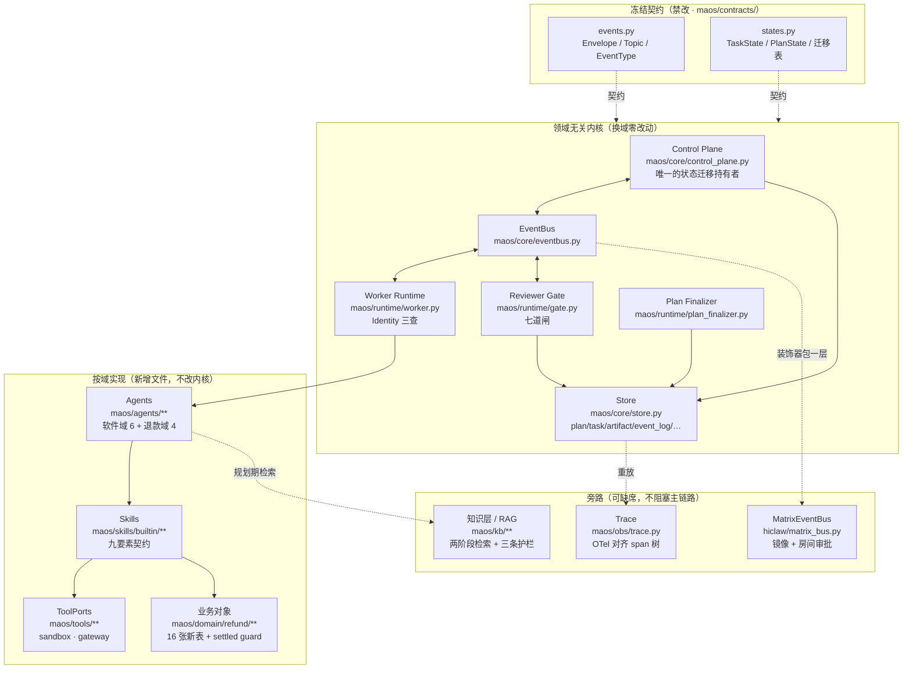
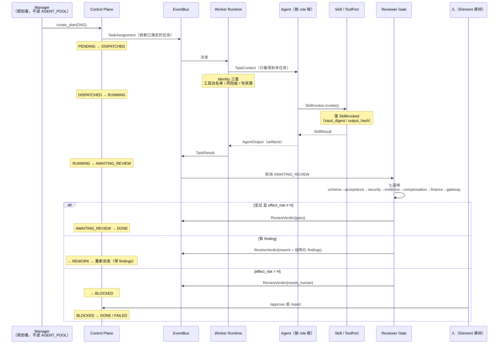
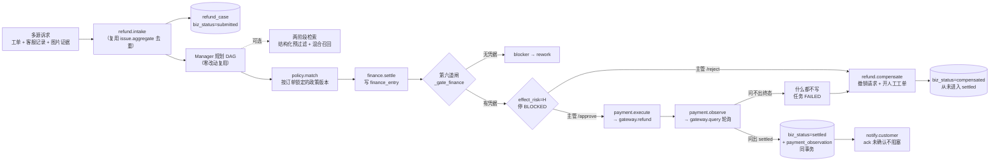
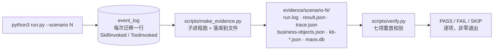

# 架构与数据流

一句话：**Control Plane 是唯一的状态持有者，其余全是可插拔件。**

Agent 不改状态，只产出；Gate 不改状态，只出判定；Skill 不碰外部世界，
碰外部世界的一律经 ToolPort；外部系统的终态不进 MAOS 的库，只以「观察」的形式进。

---

## 1. 分层

**读法**：`FROZEN` 一块在退款域上线前后 `git diff` **严格为零**；`KERNEL` 一块不是零
（`maos/core/` +46/−2、`maos/runtime/` +273/−7），但改动全部是**领域无关**的判据
（第六/第七道闸与重规划口径，不 import 任何业务域，两条 AST/import 守卫钉着），
论证见 [`domain-portability.md`](domain-portability.md)。

---

## 2. 一个任务的生命周期

三条不变量：

1. **只有 Control Plane 改状态。** Agent、Gate、Skill 一律通过发事件请求迁移，
   自己不写 `task.state`。迁移合法性查 `maos/contracts/states.py` 的迁移表。
2. **每一次迁移落一条 `event_log`。** 这是 Trace 与证据束唯一的数据来源 ——
   没有第二份记录，也就没有「日志和库对不上」这种事。
3. **幂等与版本冲突在 Control Plane 一处收口。** 重复投递同一个 `TaskResult`
   不产生第二次迁移（场景 4 就在验这个），换 MQ 的前提就是这一条。

---

## 3. 数据流：一条退款 case 从诉求到收口

**题眼在 `OBS` 那个分叉**：问不出终态时，系统**什么都不写** —— 不猜、不推断。
详见 [`authoritative-facts.md`](authoritative-facts.md)。

---

## 4. 证据是怎么长出来的

三条纪律（铁律 3 / 铁律 6）：

- 每个证据文件首行 `# generated at <ISO8601> from <git sha>`，生成脚本自动写入；
  工作区不干净时 sha 带 `-dirty` 后缀。
- **上游命令失败即报错退出，绝不写占位数据。** 先在临时目录攒齐、全部成功才挪到位；
  中途失败连临时目录一起删 —— 宁可目录缺一半，也不许留半份看起来像跑通了的产物。
- **脱敏走两道**：写入时把敏感环境变量的值替换成 `***REDACTED:<VAR>***`，
  写完再拿这些值当哨兵把整个目录反查一遍，命中即销毁目录并失败。

---

## 5. 存储

| 表 | 归属 | 说明 |
| :-- | :-- | :-- |
| `plan` / `task` / `artifact` / `event_log` / `processed_key` | 内核（Phase 0） | **DDL 被 `.contracts.lock` 指纹锁死**，禁改 |
| `knowledge` | 内核（Phase 4 新增表） | 复盘条目 |
| `kb_doc` | 知识层（`maos/kb/`） | 结构化知识：政策 / 历史案例 / 失败提示 / 错误码手册 |
| 退款域 16 张 | `maos/domain/refund/schema.sql` | `refund_case` / `refund_request` / `payment_observation` / `finance_entry` / `business_ref` / … |

### 业务对象与知识层在 PolarDB，控制面在本地 SQLite

这条切分是**有意划的，不是迁移做了一半**：

| 面 | 表 | 落在哪 | 怎么切过去 |
| :-- | :-- | :-- | :-- |
| **业务对象 + 知识层** | 退款域 16 张 + `kb_doc` | 可切 PolarDB PG | `MAOS_DOMAIN_BACKEND=postgres` + `MAOS_PG_DSN`，经 `maos/domain/_dbport.py` |
| **控制面** | `plan` / `task` / `artifact` / `event_log` | 本地 SQLite | 暂不可切：`maos/flows/common.py` 的 `build()` 仍写死 `SqliteStore` |

**为什么这样切。** 控制面那四张表是**本进程的事务日志** —— 状态迁移、闸的判定、产物指纹，
它们的读者只有这一次运行自己，和事后拿它重放的 `scripts/verify.py`；没有第二个系统要查它们，
搬上托管库只换来一次网络往返和一个新的失败模式。业务对象反过来：`refund_case` /
`payment_observation` / `business_ref` 这些是**要给外部系统与评委查的东西** —— 要活过这一次运行、
要能被别的服务连上去读、要能按租户横向扩。那正是 PolarDB 该接的面。

`maos/domain/_dbport.py` 是这条切分的实现，口径是 **DDL 只写一份**：片段作者仍然只写
SQLite 方言的 `schema.sql`，PG 侧由 `to_pg_ddl()` 现翻，翻不动的构造抛 `UnsupportedDdlError`
而不是静默跳过 —— 静默跳过等于 PG 上少一张表，而少一张表的症状要到跑的时候才出现，
且只在配了 PG 的那台机器上出现。

**实测到哪一步**（口径与 `docs/submission-checklist.md` 的 A-4 表逐字一致，别说过头）：
本机 Docker `pgvector/pgvector:pg16` 上同构验证跑通；阿里云 PolarDB PostgreSQL 版真实例
2026-08-30 冒烟跑通 —— 高权限账号五步 5/5，控制台建的普通账号 2/5（建扩展与 `public` 建表
两处 `InsufficientPrivilege`）。三步怎么迁在 `deploy/polardb.md`，真实例上跑通了哪几条、
没跑通哪几条在 `deploy/polardb-live.md`。
🔴 **不许说「本仓库缺省支持中文分词检索」** —— `zhparser` 在那台实例上装成过、中文召回也实测过，
但仓库缺省的 `MAOS_PG_FTS_CONFIG` 没指 `zhcfg`，走的是 `simple`。

后端可插拔：`maos/store/port.py` 定义 `StorePort`，`sqlite_store.py` 是默认实现，
`pg_store.py` 是 Postgres / PolarDB 分支的**真实现**（全文走 `to_tsvector` / `ts_rank`，
向量走 pgvector 的 `<=>`）。没装驱动 / 没配 DSN / 连不上时一律抛 `PgBackendUnavailable`，
**绝不静默回落 sqlite** —— 回落是这类后端最容易出的无症状错误：你会以为 PG 验过了，
其实一行 PG 代码都没执行。它继承 `NotImplementedError` 是有意的，为的是让「不许静默回落」
那条冻结测试在有驱动和无驱动两种环境下都绿，语义一个字没松。

⚠️ 如实说明，两个面的接线程度**不一样**，别混着说：

- **控制面仍写死 SQLite。** `maos/flows/common.py` 的 `build()` 里是 `SqliteStore()`，
  `maos/store/**` 那套 `StorePort` 在主链路上一个 import 都没接 —— **有地基、未接线**，
  已记 `docs/BACKLOG.md ## task-W2`。
- **业务对象层已可插拔。** 退款域 16 张表 + `kb_doc` 经 `maos/domain/_dbport.py` 走双后端；
  不设 `MAOS_DOMAIN_BACKEND` 时走 sqlite 分支，行为与本模块出现之前**逐字节相同**。

---

## 6. 模型在哪里、不在哪里

- **在**：Agent 的语义工作（需求归一、架构契约、写补丁、语义审查、政策条款匹配）。
- **不在**：状态迁移、Gate 判定、replan 触发、审批、补偿、权威事实写入。

> **replan、补偿、审批是控制面行为，其正确性不得依赖模型的智力表现。**

所以 Gate 是**规则驱动**而不是模型驱动（`maos/runtime/gate.py:6` 写明），
需要模型参与的语义审查走 Reviewer Agent，挂在 Gate 之后、审批之前。

无 key 也能完整跑：`ScriptedModelClient` 按关键字返回预置应答，场景 1–7 与全部测试
恒走这条路 —— 演示不依赖任何外部 API。
